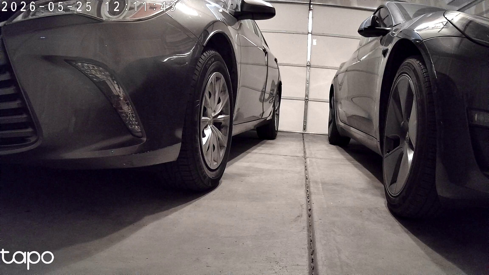

# Garage Door Vision Monitor

A Python-based system that watches your garage door using a TP-Link Tapo security camera. It captures frames from the camera's live video feed, compares them against reference images of the closed door, and sends you a Telegram alert if the door is left open.

## Key Features

- **Automatic monitoring** -- checks your garage door on a schedule that adapts to what it sees: a slow interval while the door is closed, and a faster one while it is open
- **Recurring reminders** -- keeps reminding you every few minutes for as long as the door stays open, not just once
- **Multi-signal detection** -- uses three independent signals (image similarity, texture complexity, brightness) with 2-of-3 voting for robust classification
- **Multi-reference matching** -- compares against multiple reference images (two cars, one car, no cars, day/night) to handle different garage configurations
- **Telegram alerts** -- sends a photo and message to your phone when the door is open, and an all-clear when it closes
- **On-demand status** -- send `/status` to the Telegram bot anytime to get a live photo and door state
- **Day/night support** -- handles the camera's automatic IR night mode and daytime color mode switching
- **Calibration tools** -- scripts to capture reference images, run test validation, and tune detection thresholds

## Tech Stack

- **Language:** Python 3.x
- **Vision:** OpenCV (`opencv-python`) for frame capture, `scikit-image` for SSIM (Structural Similarity Index) calculation
- **Messaging:** `python-telegram-bot` (v20+ async)
- **Camera:** TP-Link Tapo via RTSP stream
- **Config:** `python-dotenv` for environment variables

## How It Works

The monitor uses a **2-of-3 voting system** with three independent signals to decide if the door is open or closed:

1. **SSIM (image similarity)** -- compares the current frame against reference images of the closed door. A low score means the image looks different from the closed state. If below the threshold (default: 0.55), votes OPEN.
2. **Laplacian variance (texture complexity)** -- measures how much visual detail is in the door region. An open door reveals the outdoors, which has much more texture than a flat closed door. If above the threshold (default: 700), votes OPEN.
3. **ROI brightness** -- measures how bright the door region is. Behavior depends on camera mode:
   - **IR/night mode:** an open door appears darker (looking into darkness outside). If below threshold, votes OPEN.
   - **Daylight mode:** an open door appears brighter (outdoor light flooding in). If above threshold, votes OPEN.

If **2 or more signals** vote OPEN, the door is classified as open.

**Override:** If SSIM votes OPEN and the door region has very low variation (standard deviation), the door is forced to OPEN regardless of the other signals. This catches the case of a pitch-black open door at night where Laplacian and brightness can't distinguish it.

When the door is confirmed open, a Telegram alert with a photo is sent. When it closes again, an all-clear message is sent.

## Alert Timing

The monitor changes how often it looks at the camera based on what it last saw:

| State | How often it checks | What happens |
|-------|--------------------|--------------|
| Door closed | every `INTERVAL_MINUTES` (default: 15) | quiet, just watching |
| Door open | every `REPEAT_ALERT_MINUTES` (default: 15) | alerts, then reminds you at that same interval |
| Door closes again | back to `INTERVAL_MINUTES` | sends the all-clear, returns to slow checking |

This matters because **a reminder can only be sent on a check.** If the monitor only looked at the camera every 30 minutes, asking for a 5-minute reminder would still get you one every 30 minutes -- there is nothing running in between to send it. Dropping to the reminder interval while the door is open is what makes the shorter setting actually work.

The trade-off to know about: because checks are spaced `INTERVAL_MINUTES` apart while the door is closed, the door can already be open for up to that long before the first alert arrives. If you want to hear about it faster, lower `INTERVAL_MINUTES` -- at the cost of contacting the camera more often all day.

## Prerequisites

- Python 3.10+ ([download](https://www.python.org/downloads/))
- A TP-Link Tapo camera on your local network with RTSP enabled
- A Telegram bot token (create one via [BotFather](https://t.me/botfather))
- Your Telegram chat ID(s)

## Installation

```bash
# Step 1: Clone the project and enter the folder
git clone https://github.com/vashwar/GarageDoorMonitor.git
cd GarageDoorMonitor

# Step 2: Install dependencies
pip install opencv-python scikit-image python-telegram-bot python-dotenv

# Step 3: Set up environment variables
# Create a .env file in the project root (see Environment Variables below)
```

> **Note:** `.env` holds your camera password and bot token, and is listed in `.gitignore` so it is never committed. Never share it or paste its contents anywhere.

## Environment Variables

Create a `.env` file in the project root:

| Variable | Description | Required |
|----------|-------------|----------|
| `RTSP_URL` | Your Tapo camera's RTSP stream URL | Yes |
| `TELEGRAM_BOT_TOKEN` | Bot token from BotFather | Yes |
| `TELEGRAM_CHAT_IDS` | Comma-separated Telegram chat IDs to receive alerts | Yes |
| `REFERENCE_IMAGES` | Comma-separated paths to reference images | Yes |
| `SSIM_THRESHOLD` | Similarity threshold (0-1). Below this = door open | No (default: 0.55) |
| `INTERVAL_MINUTES` | How often to check **while the door is closed** | No (default: 15) |
| `OPEN_ALERT_MINUTES` | Minutes door must stay open before the first alert. `0` = alert as soon as it is seen open | No (default: 5) |
| `REPEAT_ALERT_MINUTES` | How often to re-send the reminder while the door stays open. Also becomes the check interval while open | No (default: 15) |
| `LAPLACIAN_THRESHOLD` | Texture complexity threshold. Above this = door open | No (default: 700) |
| `BRIGHTNESS_IR_OPEN_MAX` | IR mode brightness below this = door open | No (default: 85) |
| `BRIGHTNESS_DAY_OPEN_MIN` | Daylight brightness above this = door open | No (default: 165) |
| `CONSECUTIVE_OPEN_REQUIRED` | How many checks in a row must say OPEN before alerting. `1` = alert on the first one; `2` = ignore a single odd frame. Values below 1 are raised to 1 | No (default: 2) |
| `ROI_STD_THRESHOLD` | Low ROI standard deviation override threshold | No (default: 55) |

### Camera connection settings

You will not normally need to change these. They bound how long the monitor waits on a slow or unreachable camera before giving up, so one bad connection cannot stall it.

| Variable | Description | Required |
|----------|-------------|----------|
| `CAPTURE_OPEN_TIMEOUT_MS` | Milliseconds to wait for the video stream to open | No (default: 8000) |
| `CAPTURE_READ_TIMEOUT_MS` | Milliseconds to wait for a frame to arrive | No (default: 8000) |
| `CAPTURE_RETRIES` | How many times to retry a failed capture | No (default: 3) |
| `CAPTURE_RETRY_BACKOFF` | Seconds to wait between retries | No (default: 5) |

## How to Run

```bash
# Start the monitor (runs continuously)
python garage_monitor.py

# Or use the batch files on Windows:
start_monitor.bat    # runs in background
stop_monitor.bat     # stops the background process
```

Once running, the bot listens for Telegram commands:

- `/status` or text `status` -- captures a live photo and reports door state

### Sample Telegram Message

When you send `/status`, the bot replies with a photo and caption like this:



```
Garage is CLOSED
SSIM: 0.8830 (CLOSED)
LapVar: 186 (CLOSED)
Bright: 138 (CLOSED, ir)
ROI Std: 41.0
Votes: 0/3 OPEN
Time: 2026-05-25 12:11:47
```

When the door is left open, the alert message looks like:

```
ALERT: Garage door has been OPEN for 5 minutes!
SSIM: 0.3784 (OPEN)
LapVar: 1075 (OPEN)
Bright: 180 (OPEN, daylight)
Votes: 3/3 OPEN
Time: 2026-05-25 17:30:58
```

And when it closes again:

```
Garage door is now CLOSED.
Was open for 6 minutes.
```

## Project Files

| File | Purpose |
|------|---------|
| `garage_monitor.py` | Main monitor -- runs continuously, sends Telegram alerts |
| `capture_reference.py` | Interactive tool to capture new reference images from the camera |
| `calibrate.py` | One-time calibration -- captures a frame and shows SSIM scores against all references |
| `scheduled_calibrate.py` | Continuous scheduled capture with CSV logging (for tuning thresholds) |
| `run_capture.py` | Single-frame capture for use with Windows Task Scheduler |
| `test_harness.py` | Validates all calibration images against current references and thresholds |
| `validate_detection.py` | Runs the 3-signal detection pipeline on all images and produces a CSV report |
| `refimage/` | Reference images of the closed garage door |
| `images/` | Captured frames from the monitor (auto-cleaned, keeps last 30) |
| `calibration_images/` | Captured frames from calibration runs |
| `calibration_log.csv` | Log of all calibration captures with SSIM scores |

## Adding Reference Images

If the monitor produces false positives (classifying a closed door as open), you likely need a new reference image for that lighting condition:

1. Save the misclassified image to `refimage/` with a descriptive name
2. Add the path to `REFERENCE_IMAGES` in `.env` (comma-separated)
3. Restart the monitor

Common scenarios that need their own reference: daytime vs nighttime (IR mode), different car configurations, seasonal lighting changes.

## Troubleshooting

**Only run one copy at a time.** Telegram allows a single program to listen for a bot's messages. If a second copy starts, both will fail with `Conflict: terminated by other getUpdates request`. On Windows, check with `tasklist | findstr python` and stop any strays with `stop_monitor.bat`.

**Reminders arriving less often than expected.** A reminder can only be sent when the monitor wakes up to check. Make sure `REPEAT_ALERT_MINUTES` is not larger than you intend -- while the door is open, it sets both the reminder gap and the checking interval.

**Alerts for a door that is closed.** Add a reference image for that lighting condition (see above), or set `CONSECUTIVE_OPEN_REQUIRED=2` so a single odd frame cannot trigger an alert on its own.

**No alerts at all.** Confirm the monitor is actually running -- if it was started with `start_monitor.bat` it runs invisibly in the background with no window. Send `status` to the bot on Telegram; if there is no reply, it is not running.

## License

No license file is included, so all rights are reserved by default. Add a `LICENSE` file if you intend to share this publicly.
